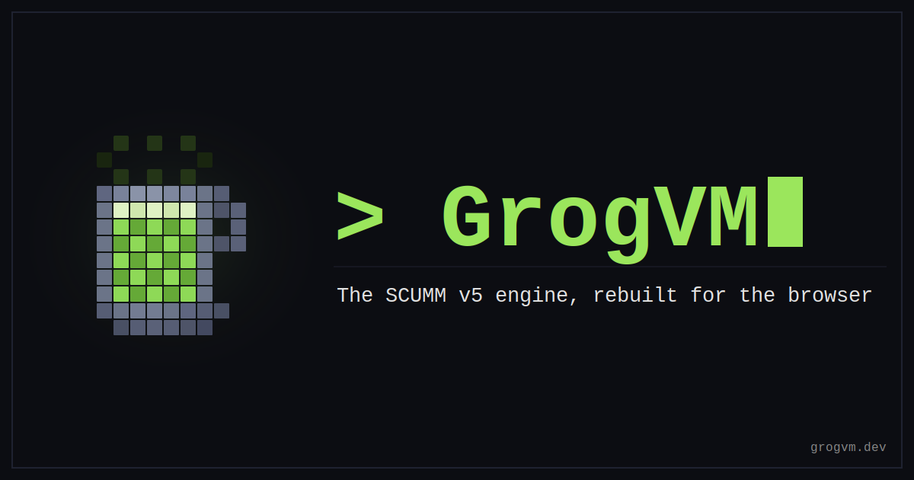

A from-scratch TypeScript reimplementation of the SCUMM v5 engine — the
one behind *The Secret of Monkey Island* and *Monkey Island 2: LeChuck's
Revenge* — running natively in the browser. No server, no emulator: you
point GrogVM at your own copy of the game, and it never leaves your
machine.

Clarity is prioritised over performance, and the player deliberately
exposes every decoder's intermediate state, so the engine doubles as an
inspection tool: every room, costume, script and sound in the game files
is browsable.

It's a love letter to *Monkey Island*, LucasArts and Ron Gilbert,
written with AI doing the typing: the code is largely the work of
Anthropic's Claude (Opus 4.8) driven through Claude Code — every binary
format reverse-engineered against real game bytes, every engine decision
disassembled and verified against the original rather than guessed. The
full story is in [pages/why.md](pages/why.md).

## Status

In active development. *The Secret of Monkey Island* is playable from
boot well into the game — verbs, inventory, dialogue, cutscenes, saves —
with audio and the rest of the walkthrough in progress.
[PROGRESS.md](PROGRESS.md) is the live tracker — what's in flight,
what's done, and what's next.

## Running

```bash
git clone https://github.com/roccozanni/grogvm
cd grogvm
npm install
npm run dev
```

Open <http://localhost:5173> in a Chromium-based browser (Chrome, Edge,
Arc). Brave users need `brave://flags/#file-system-access-api` set to
**Enabled** — the per-site Shields toggle does not cover this API.

From the library screen, click **Install game…** and select a directory
that contains either `MONKEY.000` + `MONKEY.001` (MI1) or `MONKEY2.000`
+ `MONKEY2.001` (MI2). The browser asks you to re-grant read permission
each session — a security requirement of the File System Access API,
not something the app can persist.

## Tests

```bash
npm test           # watch mode
npm run test:run   # one-shot
npm run typecheck  # tsc --noEmit
npm run build      # full typecheck + production bundle
```

The engine core is fully testable in Node — no DOM, no browser globals.
Decoders are pinned by handcrafted byte fixtures, and a single seeded VM
is driven through MI1's own walkthrough from boot as a regression net
(`npm run test:integration`, needs the game files installed locally).

## Documentation

Everything deeper lives in [`pages/docs/`](pages/docs/index.md), in two
halves:

- **Engine notes** — how GrogVM itself is built, starting with the
  [architecture](pages/docs/engine/architecture.md): the layers, the
  seams, and the principles behind them.
- **SCUMM v5 reference** — self-contained write-ups of every binary
  format GrogVM has cracked open: rooms, backgrounds, costumes, fonts,
  occlusion masks, the index file, the full opcode set. Each documents
  the corrections GrogVM needed to make over the long-circulating
  reverse-engineering notes.

The same pages ship as the project site at <https://grogvm.dev>.

## License & legality

GrogVM is free software, licensed under the **GNU General Public
License, version 3 or later** — see [LICENSE](LICENSE). It comes with
no warranty, to the extent permitted by law.

GrogVM bundles and distributes no LucasArts assets — you must obtain
MI1 / MI2 legally yourself, and the project has a strict no-piracy
policy ("abandonware" is not a legal category). This is a personal
learning project with no intent to ship a competing product. The classic
VGA data GrogVM plays ships inside *The Secret of Monkey Island: Special
Edition* on GOG / Steam. Full details — where to get the game, the
no-piracy policy, trademarks, and a rights-holder contact — are on the
[legal page](pages/legal.md) (live at <https://grogvm.dev/legal/>).
